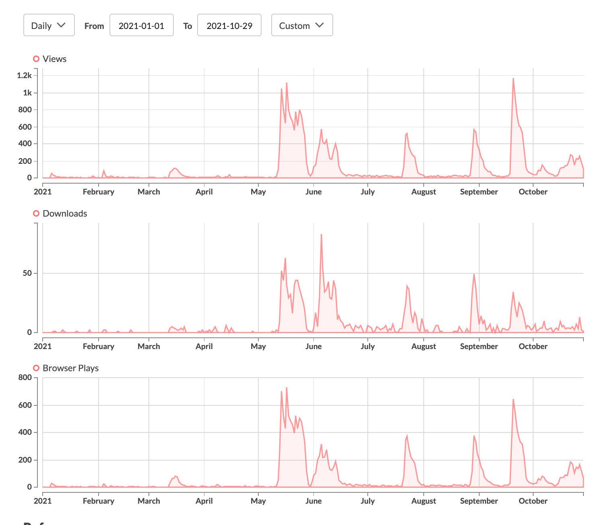
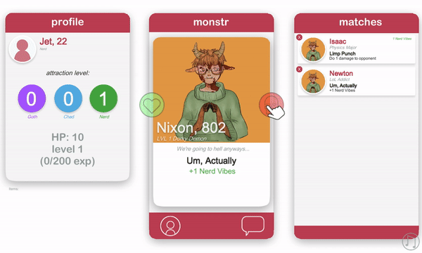
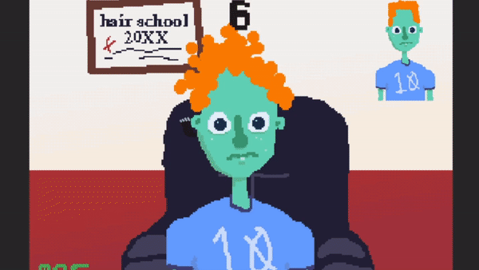
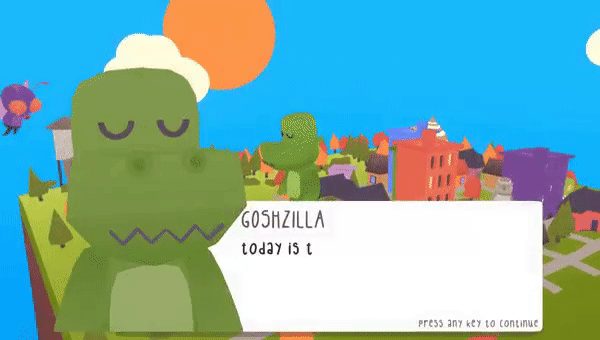
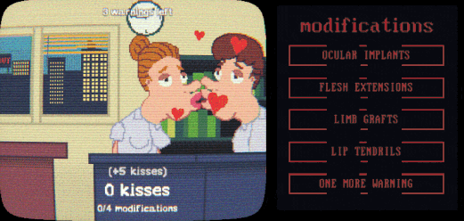

Hello,

I was itching to write *something* on this thing. So I took a look at my **[itch.io](http://www.itch.io/simonjet)** analytics and decided to share how participating in one game jam every month and releasing said game on itch.io has helped me.

Below is a picture of the raw stats since January 2021. Note that before 2021, none of my games got more than 300 views. That is now usually the minimum amount of views a project will get.

**Part 1 - January to April**

The year started off fairly middling. You notice some *small* bumps in views each month. This is from the boost in visibility itch.io gives you on release. In my opinion, many of these early games were of average to less than average quality. My favorite of this bunch is January's entry, puzzle game [**Distanced**](https://simonjet.itch.io/distanced). The puzzles were tough to make but rewarding, and I'd like to make more puzzle games in the future. The biggest success of these early months comes in March, with the release of [**Monstr**](https://simonjet.itch.io/monstr).  *Monstr* is a short deck-building-roguelite-dating-sim where you have to swipe on (like Tinder) different types of monsters to add them to your party. If the monster doesn't like you back, then you must fight them. This continues until you defeat the final boss, The Vampire Queen. The game had a strong concept and hook, and the views reflect that. The game wasn't a bigger success because it just wasn't balanced or fun enough. The game got people in the door (hence the biggest views in this chunk), but they didn't want to tell their friends about it.  Although these games wouldn't be among my best work now, each one was generally an improvement on the other, and each one taught me new lessons about development. Hence although this early period didn't get the most attention, it was extremely helpful for my abilities. Plus it's not about the views (not always). 
  

**Part 2 - May To August**

May is when I had my first bigger success story, [**7 Second Haircuts**](https://simonjet.itch.io/7-second-haircuts). It currently is my most popular game with ~16000 views. I believe this game's success is due to three major factors:  

1. The game is short, but has a **fun and simple mechanic** that is slowly introduced. Building the whole game around one simple mechanic was a great idea!  
2. It was **a culmination of my efforts**. I was able to put all the lessons I had learned in the previous months into this game. This game represents a major over all step up in my abilities.  
3. This game was put **in the Palestinian Aid Bundle**. You may notice that June's game appears to have also got a lot of views. This is false, June's game was somewhat of a failure because I was worried about following up to 7 Second Haircuts. Haircuts just got a **second boost in views in June due to this bundle**.  

July featured a aesthetically similar game to Haircuts, [**Shapeshifter In Love**](https://simonjet.itch.io/shapeshifter-in-love). I don't have much to say about this game other than it taught me some neat UI tricks. It was a moderate success as well. By the end of July I was getting tired of making 2D games. So in August I fired up Blender and decided to go with a unlit cartoonish look for my next game. This game was [**Goshzilla Is In Love**](https://simonjet.itch.io/goshzilla-is-in-love). 
  
*Goshzilla* is a short and quirky giant monster dating simulator. It has three different endings and a somewhat destructible city. I am very proud of how the visual's in this game turned out, and it was a great example of a game having two lives. That is, the game did fairly well in it's first month and then died down. But then a couple months later a gaming blog picked it up, and it had a second peak in views. This solidified a belief I have that quality games will age well over time. Where as a cheap cash in may burn bright once, but not have any lasting impact. 

 

**Part 3 - September to October**

Well we have caught up with the present. It is hard to say much about the games from this month. In October I made [**Office Kiss: Edge of Humanity**](https://simonjet.itch.io/office-kiss-edge-of-humanity). It is a short idle/horror game inspired by the flash games of my youth. You can see this game released in October with the biggest spike in views all year. This was also combined with some residual *Goshzilla* views. *Office Kiss* was played by many indie horror YouTubers, making it another contender for my biggest success so far. Though personally I am more of a fan of *7 Second Haircuts*.

I have also just released [**Extremely Short Wine Tycoon**](https://simonjet.itch.io/extremely-short-wine-tycoon) this month. It hasn't been a huge success but it has gotten 1000+ views and has a couple dedicated fans. This proves my point from earlier that the more games you release and produce, the more fans you get, and the more your average viewership and engagement goes up for each game you release.  

I highly recommend anyone who wants to hone their skills as a game developer challenge themselves to making one game a month. It will make you a better dev and give you experience finishing and releasing projects. They don't have to be big games, they don't have to best your best, just put 'em out! Oh, and don't forget to give yourself a break after. 

---

For a more in-depth (if not uglier) look into the games I've made this year, check out [**this page**](http://www.jetsimon.com/2021). I will also be making a YouTube video about this whole situation in early 2022.