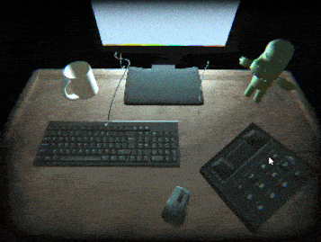

My November "I make one game a month in 2021" game is a short SCP & analog horror inspired game called [flies in a jar](https://simonjet.itch.io/flies-in-a-jar). And it was decently succesful. 

Well, maybe a little bit more than decent. It is currently my number two most played game after only two weeks. Currently sitting at 9k views on itch.io. I think this number is probably a bit more too given it seems a lot of online game portals have copied it onto their sites. Not that I mind when that happens, because at least more people are playing my games and I'm credited. Remember that chart from [last post](https://jetsimon.com/blog?post=10-months-of-one-game-a-month)? It looks like this now.

As you can see this was probably my most "viral" game. As it got almost 2000 views per day at its peak, and is still getting ~300 views per day still. I am very happy with that! However, I would like to know *why*.

My current theory is that itch.io just loves indie horror games that you can play in your web browser. A large percentage of players seem to be younger users, and younger users like horror games. Also my game is more *unsettling* than straight up scary, with only **one** jumpscare (gasp)! I know that I love playing horror games on itch.io. I have played almsot every single [horror game by corpsepile](https://itch.io/profile/corpsepile), a developer who definitely makes better games than this one, and who was a huge inspiration. 

I also think the community for Lets Plays of horror games is still going really strong. As much as people make fun of old PewDiePie content where he just screams into his mic, that never really went away. Now it's just done by different YouTubers, like [ManlyBadassHero](https://www.youtube.com/watch?v=7Is-V8PE1y4) or [Adrionic](https://www.youtube.com/watch?v=RZkgtTjHsdI&t=2s). Both YouTubers who brought this game to a wider audience. 

My third reason is I think players really like the tacatile feeling of having to dial a phone, open an email, or type an ARG puzzle solution into their browser. But maybe that's just me because I love those things in games. My friend [Tim Sheinman](https://tim-sheinman.itch.io/) was also a huge inspiration to this project and also makes games with tactile interfaces and ARG puzzle elements.

I also think I did a pretty good job on the game itself. It looks good for what it is, and it is also somewhat polished for what it is: a game made in a week or so for the Github Game Off Game Jam.

Anwyays, enough getting into my own head about "why I think something is succesful". It's good to consider these things, but it's better to actually learn game design lessons from the game you make. And I learned a few things from this one too!

First off, I learned a **lot** about scroll bars and Unity. They were always a mystery to me, and I never really wanted to put in five minutes to google about them, until I had to make the email client.

I really wanted to nail a vintage Windows XP style UI for this game. And also I wanted to put in longer emails, so the scroll bar was needed. There were some hiccups and hacky workarounds. For example the spam emails you have at the start of the game only exist because I was unable to have fewer than 5 emails center in the window correctly. But I think it works *and* had the unintended side effect of adding some well needed **comedic genius** (yes, I am both funny and humble! The whole package!)

I also learned a good amount about a topic that I always am happy to learn more about: making puzzles. Originally the game gave fewer hints for the first email puzzle. But when I sent it out to my playtesters (read: my 19 year-old brother) they had trouble figuring out that the scrambled message was a URL. So I added the leading www to the URL to signal more to the player. A small lesson, but it's always good to try and fine tune how much information one should give to the player. 

He also had an idea of an easter egg when the player dials 911, which made it into the final game and a couple people commented saying it made the world feel more alive. 

This was a pretty fun game to make, and because I tied in some of my earlier games as easter eggs, I think I could get a real Jet Cinematic Universe going on. I'm not sure if I want to make more horror games soon, even if they do well on itch. Something about cute smol games is just really calling to me right now. We will see what December holds.

Thanks for reading,

Jet

