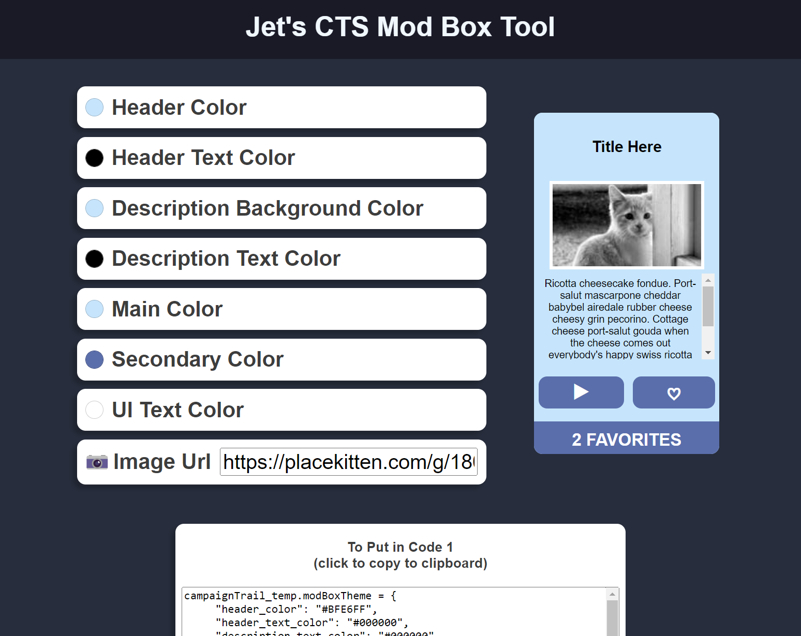

Hello,

My third little React project actually arose out of utility. For those who do not know, I am active in the modding community for a web game called [The Campaign Trail](https://www.americanhistoryusa.com/campaign-trail/). It is a browser based game where you answer questions and try to win elections (generally, some of the mods get a bit more esoteric. For example I made [one where you play as The Beatles](https://campaign-trail-showcase.github.io/campaign-trail/index.html?modName=1964Beatles)). I'm not too into US history but my brother Tex is, and I enjoy making modding tools for the community.

My past projects include [a tool that lets people easily edit their JSON formatted mod files with a nice GUI](https://jetsimon.com/Jets-The-Campaign-Trail-Mod-Tool-Website/) and the ability to change information from multiple sources in one place (mods are made by evaluating javascript in the console to trick the game with your own data). I also [made a site that hosts some of the mods](https://campaign-trail-showcase.github.io/). 

Anyways, with that context, this project has to do with the aforementioned mod-hosting-site. If you clicked on that link you may notice each mod is hosted in it's own "mod box". Recently there was a request for the feature for modders to colour their boxes how they wish. Because I am eager to please anyone that shows interest in things I make, I added it (along with the ability to turn the feature off if it gets too gaudy)! But to colour your mod box you had to play around with JSON objects and tediously trying colour schemes over and over, so...

To simplify that, I made [Jet's CTS Mod Box Tool](https://jetsimon.com/cts-mod-box-tool/) (yes, everything I make in this community has my name in it. See: Bennett Foddy).

It is a simple editor with colour pickers and editable text/images. A pretty simple app, but one that React was really well suited for. I just store the state in the App.js file and it is passed down as props to the color pickers, text inputs, and mod box view.

After you are done editing you simply copy the relevant javascript code to add to your mod, and then it "just works"!

I'm happy with how this turned out and it was good practice. The best part was adding a hover effect to the circular colour pickers. Front end can be pretty neat.