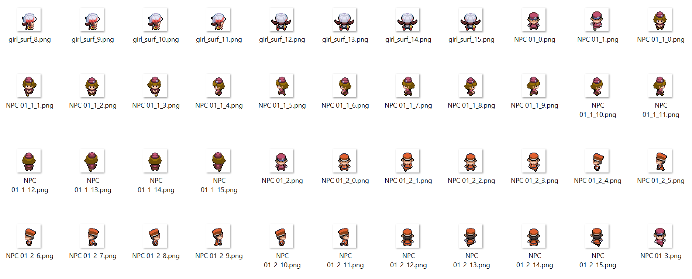
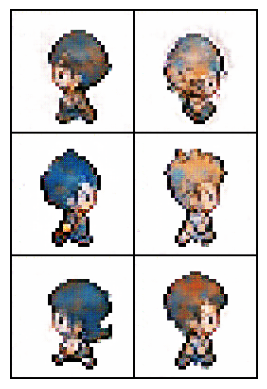
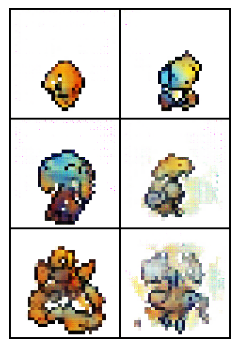

Hello,

This post will be all about training a GAN to generate Pokemon sprites! Now first off I want to address a key point:

- Obviously Pokemon is not owned by me. I am not trying to use these images commercially. They are just the first thing that popped into my head.
- I don't think we should be replacing pixel artists with AI! This is just a fun activity to do. 

Also, I know that diffusion is the big thing in image generation right now. From DALL-E to Midjourney to Stable Diffusion. The reason I'm using a GAN is because:

1. I think it's easier to train on what I have, and I know how to work with it.
2. It's just a small hobby project
3. I notice that Diffusion networks often have a terrible time making decent quality pixel art. I want to see if I can get a GAN to do a better job.

That being said for point 3, I don't know if diffusion networks are inherently bad at generating pixel art. I think the real reason is because they are trained to generate images around 512x512 in size. Obviously with such big images trying to emulate a smaller target size you're going to have some things that don't look pixel perfect.

---

I am using a WGAN network haphazardly adapted from a few resources on the web. The first thing I trained it on was a dataset of ~3700 NPC overworld images that I got by writing a script to slice a bunch of spritesheets I downloaded from the internet. I upscaled each image to be 128x128 to fit the network that I had. More on this later.

I started with NPC images because all NPCs in Pokemon have the same basic shape. I suspected that this would mean it would be easier for the network to generalize them to create better images.

I used a batch size of 128 and then switched it to 64 later on to try and get the network to learn finer details. After about 200 epochs I ended up with images that looked like this:

Obviously these aren't perfect but I was pretty happy with them. It's doing a reasonable job of generating NPCs and from far away I don't think you could tell too much.

With this proof of concept finished. I decided to try the network on the much harder task of generating images from a diverse set of 10k Pokemon images. These were scraped and sliced just like the NPCs. This is a harder problem because of the diversity of Pokemon, but let's see what happens...

These are my results so far (From epoch 1 to epoch 120):

**Who's that Pokemon?!**

Yeah...they aren't looking great yet. Here is a cherry picked image of one of the better epochs.

Obviously it is doing *something*. I see that it tries to make mostly symmetric pokemon with a monochromatic colour scheme that usually have something resembling eyes.

However there are also weird cases where the background is blurry or noisey.

My next step (after letting it run for a bit more today "just in case") will be reworking the network to work with a smaller, pixel perfect image size. As mention before, I think trying to generate larger images that are simulating smaller images could make it harder for the network to learn. So I'm trying that next!

I hope you've enjoyed reading about for foray into Pokemancy. See you next time!