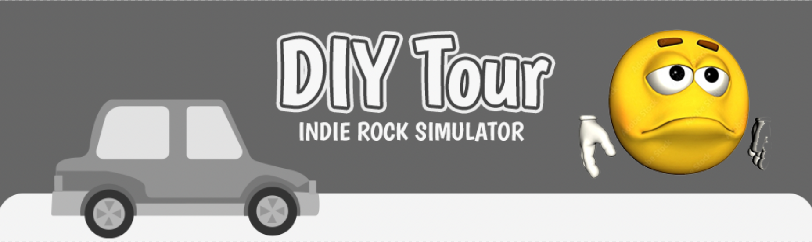

Hey guys, it's been awhile.

Last blog post I wrote I was only one game away from finishing my [*One Game A Month 2021 Challenge*](https://itch.io/c/1476380/one-game-a-month-2021)™. I was itching to work on my first major Steam release, assured by the last year of development that there was *no way* I'd fail. "I've learned how to *finish* things!" I told myself.

On January 11th 2022 (one month ahead of schedule, as I ignored the break I was going to give myself 🥴) I promptly started on my big commercial title: [DIY Tour: Indie Rock Simulator](https://simonjet.itch.io/diy-tour?secret=wRCboADa2Ul2w8a3IT5PwCk3yM). And I'm proud to say it is now playable (barely...kind of?) and even has a Steam page (like all the marketing advice says!)

But well uh, I think I've bitten off a bit more than I can chew. I may have been a little *too* overconfident in my ability to finish, and fallen into the classic indie dev trap. That endless cycle of wanting to overhaul your whole game, worrying you'll never finish, and then procrastinating and hoping it just finishes itself.

Yup, I'm a sucker. I told myself I wouldn't fall into this, and yet here I am.

That's not to say I haven't been doing anything. I've been a full time university student and recently started an internship at Unity (what the heck??). But I thought that wouldn't matter. I was able to finish the smaller projects while juggling school/a job, so why would this be any different? Well, it is.

I've barely had any time to work on the project. And the more I *do* work on it, the more I think that it's the type of project that needs a team of 4-5 developers to execute properly.

I struggle a lot with feeling like I'm betraying all the lessons I learned churning out projects quickly in 2021. But I don't think I should feel bad about this. Sometimes projects don't work out, and it's good to know when something is too much.

I don't know if anyone is reading this, I don't know if anyone cares, but I think I need to re-evaluate. I think I need to spend a month or two prototyping and finding the fun in a very simple mechanic. As a solo developer I don't think I'm able to making sprawling, living, fun rock star simulation game of my dreams. 

But for now, I think I'm going to enjoy my Summer and maybe participate in a few game jams to get my confidence back. I'm really hoping I can still get a Steam release out this year, but I'm not going to stake my self worth it in.

XOXO

Jet

